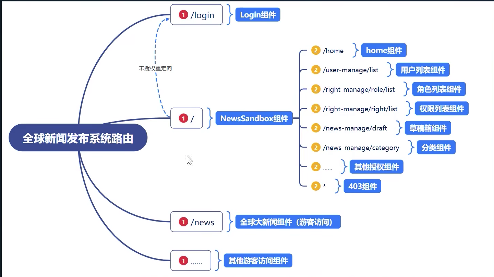
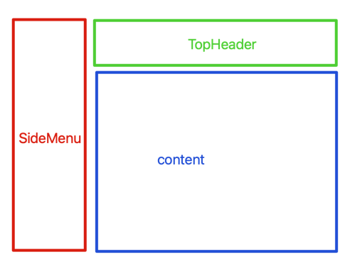

# 架构

## 路由系统



## 安装路由组件

```bash
$ yarn add react-router-dom@5
```

## 创建 Router

创建路由管理文件 `src/router/IndexRouter.jsx`

```jsx
import React from 'react'
import { HashRouter, Route } from 'react-router-dom' // # 的页面
import Login from '../views/Login'
import NewsSandBox from '../views/NewsSandBox'

export default function IndexRouter() {
  return (
    <HashRouter>
      {/* Switch 保证了只匹配一个路由， router v6 的已经用其它名字替换 */}
      <Switch>
        <Route path="/login" component={Login}></Route>

        {/* 判断是否存在 token（是否登陆）， 不存在则跳转到 /login 页面 */}
        <Route path="/" render={() =>
          // 三元表达式
          localStorage.getItem("token") ?
            <NewsSandBox></NewsSandBox> :
            <Redirect to="/login" />
        } />
      </Switch>
    </HashRouter >
  )
}
```

1. 使用 `Switch` (router v5 可用) 标签， 可以解决路由 **默认模糊匹配** 的问题。
2. 使用 `Redirect` 标签， 可以进行路由跳转。 配合 **三元表达式** 可以实现 **登陆与非登陆** 的页面渲染。

## 创建路由所调用的组件

创建路由组件 
1. `src/views`: 用于与路由相关的视图组件。
    + `Login/index.jsx`
    + `NewsSandBox/index.jsx`
2. `src/components`: 用于实际功能的组件， 共享组件。

## 搭建路由

假装登陆， 打开 chrome 浏览器工具栏， `Console` 标签

```jsx
> localStorage.setItem("token","zhangsan")
```

在 `src/views/sandbox/NewSandBox.jsx` 创建划分功能区
+ SideMenu: 左侧导航条
+ TopHeader: 头部展示区
+ Content: 内容展示区



```jsx
export default function NewsSandBox() {
  return (
    <div>
      <h3>sandbox</h3>

      <SideMenu />
      <TopHeader />

      <h3>content</h3>
      <Switch>
        <Route path="/home" component={Home} exact></Route>
        <Route path="/user-manage/list" component={UserList}></Route>
        <Route path="/right-manage/rightlist" component={RightList}></Route>
        <Route path="/right-manage/role/list" component={RoleList}></Route>

        {/* 首页重定向, 精确匹配*/}
        <Redirect from="/" to="/home" exact />

        {/* 默认路由， 无权限 */}
        <Route path="*" component={NoPermission}></Route>
      </Switch>
    </div>
  )
}
```