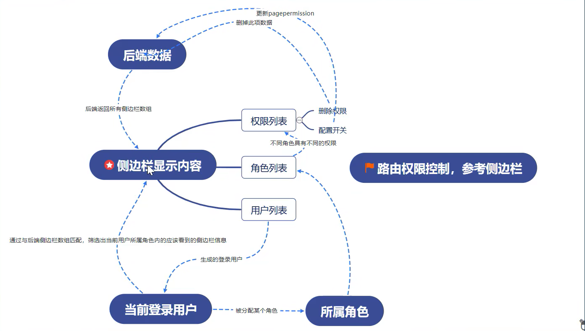

# 使用 Table 组件展示权限列表




## 使用 Table 组件展示权限列表

> table 组件: https://ant-design.gitee.io/components/table-cn/#header


```jsx
const dataSource = [
  {
    key: '1',
    name: '胡彦斌',
    age: 32,
    address: '西湖区湖底公园1号',
  }
]

const columns = [
  {
    title: '姓名',
    dataIndex: 'name',
    key: 'name',
  },
  {
    title: '年龄',
    dataIndex: 'age',
    key: 'age',
  },
  {
    title: '住址',
    dataIndex: 'address',
    key: 'address',
  },
];

<Table dataSource={dataSource} columns={columns} />;
```

1. 其中 dataSource 表示数据， columns 表示列标题。
2. 在 cloumns 中: https://ant-design.gitee.io/components/table-cn/#Column
    1. title 字段： 列展示名字
    2. dataIndex 字段: 匹配的 dataSource 中的字段值。 例如 name 匹配 name， age 匹配 age
    3. key: 使用 **受控组件时，必要， 对属性进行筛选和排序控制**。 搜索文档
    4. render: 生成复杂数据的 **渲染函数**，参数分别为**当前行的值，当前行数据，行索引**。
    5. pagination: 分页器。 当数据过多时， 分多页展示。 pagination 本身是嵌套组件， 具体参数看 pagination。 
3. 默认使用 **树形结构** 展示子菜单

## 优化 Table 输出

### render 属性

render: 生成复杂数据的 **渲染函数**，参数分别为**当前行的值，当前行数据，行索引**。

```jsx
function(text, record, index) {}	
```

使用 render 自定义， 可以默认覆盖原来的输出。 

```jsx
const columns = [
    {
      title: "ID",
      dataIndex: "id",
      key: "id",
      render: (id) => {
        return <b>{id}</b> // 加粗字体
      },
    },
    {
      title: '权限路径',
      dataIndex: 'key',
      key: 'key',
      render: (key) => {
        return <Tag color='orange'>{key}</Tag> // 使用 antd 的 Tag 组件展示
      }
    },
    {
      title: '操作',
      render: () => {
        return ( // 无数据对应， 但自定义渲染按钮
          <div >
            <Button danger shape="circle" icon={<DeleteOutlined />} />
            <Button type="primary" style={{ margin: "0 10px" }}>编辑</Button>
          </div >
        )
      }
    },
  ];
```

可以认为， 在省略 render 时， render 的默认值为 

```jsx
render: (text)=>{return {text}}
```

## 删除确认

使用 `confirm` 进行删除确认

> https://ant-design.gitee.io/components/modal-cn/#Modal.method()


需要注意的时候， 在 columns 字段中， 是否使用 dataIndex 对 render 传入参数有影响。
1. 没有 dataIndex 的时候， item 为整个数据。
2. 有 dataIndex 的时候， item 为 dataIndex 对应项目的值

```jsx
 const columns = [
    {
      title: '操作',
      // dataIndex: 'id', 

      // 没有 dataIndex 的时候， item 为整个数据。
      // 有 dataIndex 的时候， item 为 dataIndex 对应项目的值
      render: (item) => {
        return (
          <div >
            <Button danger shape="circle" icon={<DeleteOutlined />}
              onClick={() => handleDelete(item)} />
            <Button type="primary" style={{ margin: "0 10px" }}>编辑</Button>
          </div >
        )
      }
    },
  ];
```

在执行删除操作的时候， 需要注意删除的表对象。

1. **一级菜单** 对应表为 `rights`
2. **二级菜单** 对应表为 `children`

```jsx
  const { confirm } = Modal
  const handleDelete = (item) => {
    confirm({
      title: 'Do you Want to delete these items?',
      icon: <ExclamationCircleOutlined />,
      content: 'Some descriptions',
      onOk() {
        // console.log('OK', item);

        // 默认删除 rights 表数据
        let target = `http://localhost:5001/rights/${item.id}`
        if ("rightId" in item) {
          // 存在 rightId ， 为 children 表
          target = `http://localhost:5001/children/${item.id}`
        }
        axios.delete(target).then(() => {
          loadDataSource()
        })
      },
      onCancel() {
        // console.log('user Cancel', item);
      },
    });
  }
```

在上述代码中，使用了 `"rightId" in item` **in** 操作符判断 object 对象中是否具有某字段。

### 优化树状结构显示

默认情况下， 返回的数据中， children 可能为 **空数组**。 此时 antd 会将该字段也添加 **可展开按钮**。

通过使用 `list.forEach()` 方法重新定义空数组的 children 字段。
```jsx
  const loadDataSource = () => {
    const target = `http://localhost:5001/rights?_embed=children`
    axios.get(target)
      .then(
        (resp) => {
          // console.log(resp.data);
          const list = resp.data

          // 如果 children 字段长度为0， 则不要
          list.forEach((item) => {
            if (item.children.length === 0) {
              item.children = null
            }
          })

          setDataSource(list)
        }
      )
  }
```

## 使用 Popover 和 Switch 控制权限

> Switch 开关: https://ant-design.gitee.io/components/switch-cn/#header
> Popover 气泡卡片: https://ant-design.gitee.io/components/popover-cn/#header


### 使用 Popover

使用 Button 包裹 Popover
1. 当 Button 被禁用的时候， Popover 也不能使用。
2. 通过判断对象是否具有 `pagepermission` 属性来确定是否禁用 Button

```jsx
<Button type="primary" style={{ margin: "0 10px" }}
    disabled={item.pagepermisson === undefined ? true : false}
>
    <Popover content={content} title="是否在菜单可见" trigger="click"
    style={{ align: "center" }}>编辑
    </Popover>
</Button>
```

### 使用 Switch

Switch 比较简单

1. 通过 checked 属性展示标签状态

```jsx
<Switch onClick={() => { handleSwitchVisiable(item) }} checked={item.pagepermisson}></Switch>
```

### 使用 `axios.patch` 修改数据

1. patch 方法修改数据只会修改传入字段。
2. 而 put 方法则会替换整个对象。

```js
  const handleSwitchVisiable = (item) => {
    // console.log(item);

    const permission = item.pagepermisson === 1 ? 0 : 1
    let target = `http://localhost:5001/rights/${item.id}`
    if ("rightId" in item) {
      // 存在 rightId ， 为 children 表
      target = `http://localhost:5001/children/${item.id}`
    }

    axios.patch(target, { pagepermisson: permission }).then(() => {
      loadDataSource()
    })
  }
```